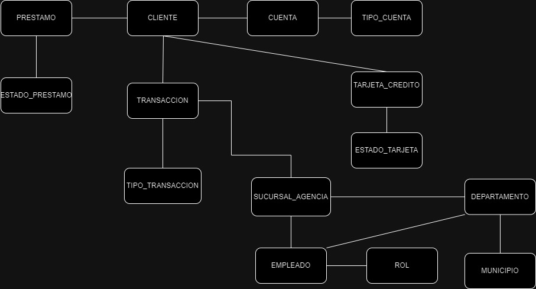
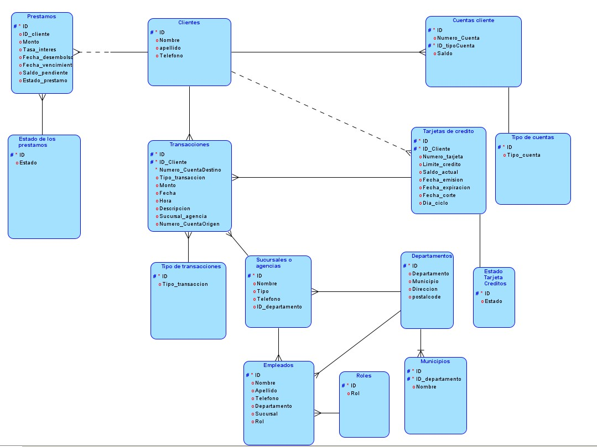
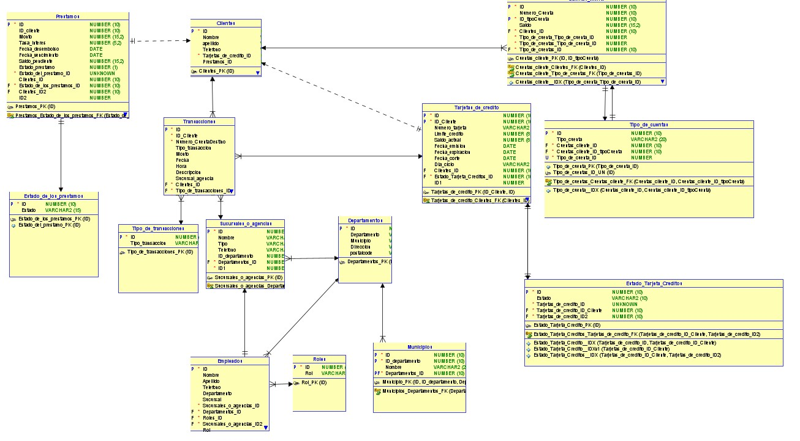

# Banco JP Morgan - Sebastian Solares- 202004822 FIUSAC
Banco JP Morgan es un banco ficticio que ofrece una amplia gama de servicios
financieros, incluyendo cuentas de ahorro, préstamos, tarjetas de crédito y débito,
además de servicios de pago y transferencias. El banco tiene presencia en todo el
país y cuenta con una amplia red de sucursales y agencias que permiten ofrecer
servicios tanto en áreas urbanas como rurales.

## Objetivo principal
El objetivo principal de este proyecto es la creación de una bases de datos relacional orientada a un banco para familiarizarse con el diseño y manejo de bases de datos SQL en un contexto bancario, desarrollando habilidades clave como la normalización, la gestión de transacciones, la creación de consultas avanzadas y la optimización para manejar grandes volúmenes de datos en un entorno de producción.


## Herramientas utilizadas

- draw.io para la realizacion del modelo conceptual
- data modeler para realizar los modelos fisicos y logicos
- SQL como base de datos
- Docker para cargar la imagen de la base de datos
- Datagrip como entorno de desarollo para la base de datos
  

## Como cargar la imagen de sql docker?

1. instalamos docker desde docker.com descargar e instalar
2. buscamos la imagen a utilizar  de oracle
 ``` Bash
   docker search oracle/database
```
3. Decargamos la imagen
``` Bash
   docker pull gvenzl/oracle-xe
```

4. creamos la imagen y levantamos un contenedor:
``` Bash
   docker run -d --name oracle-xe -p 1521:1521 -p 5500:5500 -e ORACLE_PASSWORD=your_password gvenzl/oracle-xe
``` 
5. con "docker ps" podemos verificar si esta corriendo el contenedor
6. Conectamos a datagrip la base de datos
   - **Host:** localhost
   - **Puerto:** 1521
   - **SID:** XE
   - **Usuario:** SYSTEM
   - **Contraseña:** La que especificaste en `ORACLE_PASSWORD`


## Analisis del diseño

*****Clientes*****
-- Un cliente puede tener muchas cuentas
-- un cliente es opcional si quiere tener varias tarjetas de credito
-- un cliente puede hacer varias transacciones
-- un cliente puede tener uno o muchos prestamos

*****Empleados*****

-- muchos empleados trabajan en una agencia o sucursal
-- muchos empleados trabajan en un departamento
-- muchos empleados tienen un rol

*****Departamentos*****
-- un departamento tiene muchas agencias o sucursales
-- un departamento tiene muchos empleados
-- un departamento tiene muchos municipios

*****Transacciones*****
-- muchas transacciones pueden ser de un cliente
-- muchas transacciones puede tener una tarjeta de credito
-- muchas transacciones pueden generarse para una agencia o sucursal
-- muchas transacciones tienen un tipo de transaccion

*****Cuentas Cliente*****
-- muchas cuentes puede tener un cliente
-- una cuenta de cliente tiene un tipo de cuenta


*****Tarjetas de Credito*****
-- muchas tarjetas de credito puede tener un cliente
-- una tarjeta de credito puede tener muchas transacciones
-- una tarjeta de credito tiene un estado de tarjeta de credito


*****Prestamos*****
-- muchos prestamos puede tener un cliente
-- muchos prestamos tiene un estado de prestamo


## modelo Conceptual

## Modelo Logico

## Modelo fisico



**Tabla clientes**
```sql
CREATE TABLE clientes (
    id_cliente                     NUMBER(10) NOT NULL,
    nombre                 VARCHAR2(20),
    apellido               VARCHAR2(20),
    telefono               VARCHAR2(15),
    tarjetasC_id           NUMBER(10) NOT NULL,
    prestamos_id           NUMBER(10)
);
```

**Tabla Cuentas clientes**

```sql
CREATE TABLE cuentas_cliente (
    id_cuenta                               NUMBER(10) NOT NULL,
    numero_cuenta                     NUMBER(10),
    id_tipocuenta                     NUMBER(10) NOT NULL,
    saldo                             NUMBER(15, 2),
    titular                           INTEGER NOT NULL, 
   
);
```

**tabla Departamentos**
```sql
CREATE TABLE departamentos (
    id_departamento          NUMBER(10) NOT NULL,
    departamento VARCHAR2(50),
    municipio    VARCHAR2(50),
    direccion    VARCHAR2(25),
    postalcode   VARCHAR2(5)
);
```
**Tabla Empleados**
```sql
CREATE TABLE empleados (
    id_empleado               NUMBER(10) NOT NULL,
    nombre                    VARCHAR2(20) NOT NULL,
    apellido                  VARCHAR2(20) NOT NULL,
    telefono                  VARCHAR2(15) NOT NULL,
    id_departamento           VARCHAR2(2) NOT NULL,
    sucursal                  VARCHAR2(25) NOT NULL,

    id_rol                       VARCHAR2(2) NOT NULL
);
```

**Tabla estados de los prestamos**
```sql
CREATE TABLE prestamos_estados (
    id_estadoprestamo    NUMBER(10) NOT NULL,
    estado_prestamo VARCHAR2(15) NOT NULL
);
```

**Tabla Estados de las tarjetas de credito**
```sql
CREATE TABLE estado_tarjeta_creditos (
    id_estadoTarjeta               NUMBER(10) NOT NULL,
    estado_tarjeta                        VARCHAR2(10) NOT NULL,
  
);
```